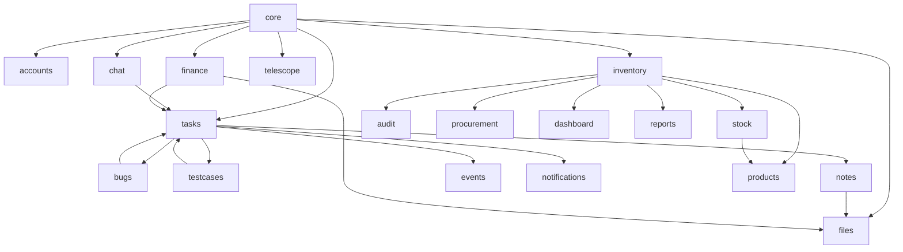

# IIAP OM — Master Technical Report (Part 3 of 3)

# CHAPTER XV — INVENTORY & SUPPLY CHAIN DOMAIN

## XV.1 Narrative Overview

The inventory domain is a **semi-autonomous product** sharing only the Django process and optionally PM user accounts with `can_access_inventory`. It models multi-branch warehouses, product catalogs, serialized assets, stock movements, procurement approvals, alerts, rentals, and statistical reports. Identity is **`InventoryUser`**, not `accounts.User`, with passwords hashed via Django’s `make_password`.

## XV.2 Branch Topology

Each `Branch` has unique `code` (e.g. KOR, HOS), display name, address, contact, `is_active`. `BranchStock` is the quantity ledger: `current_quantity`, `reserved_quantity`, rack/shelf labels, `local_sku`, `low_stock_limit`. **Quantity truth** is never edited directly except through movements—signals recalculate from entries.

## XV.3 Stock Recalculation Formula (Authoritative)

```
current_quantity = max(0, SUM(stock_in) - SUM(stock_out) + SUM(adjustment.quantity))
```

Implemented in `inventory/signals.recalculate_branch_stock()`, triggered on any `StockEntry` or `InventoryAdjustment` save/delete. `pre_save` hooks capture old branch/product when rows move—preventing stale ledger rows.

```
     Stock In ────────┐
                      ├──► BranchStock.current_quantity
     Stock Out ───────┤         (recalculated)
                      │
     Adjustments ─────┘
```

## XV.4 Products Catalog (`products`)

`Category` taxonomy includes nine default electronics categories seedable via `create_default_categories()`. `Product` carries SKU, optional unique `serial_number`, price, unit, status, supplier, image, datasheet. **Branch isolation:** non-global users see products through `BranchStock` joins filtered to their branch.

**Bulk Excel import** requires Name, SKU, Price; optional category/brand/quantity/rack/shelf; skips duplicates; auto-creates `BranchStock` when branch resolved.

## XV.5 Stock Movements (`stock`)

| Entry type | Effect |
|------------|--------|
| `in` | Increases ledger via signal |
| `out` | Decreases; blocked if quantity > available |
| `transfer` | Special case handled via `StockTransfer` model |

**Transfer lifecycle:**

```
CREATE transfer (pending)
    → immediate StockEntry OUT at from_branch
RECEIVE at to_branch (authorized staff)
    → StockEntry IN at destination
    → update rack/shelf/local_sku on BranchStock
    → status = received
```

## XV.6 Adjustments, Limits, Alerts

**InventoryAdjustment** records signed quantity changes with reason text. UI may POST increase/decrease while model stores signed integer—operators should verify consistency with `adjustment_type` field (manual/automated).

**QuantityLimit** per (product, branch) triggers **limit_reached** alerts via `check_alerts` management command. **StandardLimit** applies default threshold to products lacking explicit limits.

**Alert** lifecycle: active → acknowledged → resolved. Types: low_stock, out_of_stock, limit_reached.

## XV.7 Rentals

Rentals represent equipment leaving the warehouse temporarily. Creation validates quantity against `BranchStock`; issues stock-out entry. Return posts stock-in and closes rental record.

## XV.8 Procurement (`procurement`)

`ProcurementRequest` rows start **pending**. Admins **approve** (creates stock-in, notifies requester) or **reject** (requires `decision_reason`). Excel upload and manual forms coexist. Heuristic: `current_stock < 10` flags insufficient stock on upload view.

## XV.9 Inventory Audit (`audit`)

`AuditLog.log(user, action, instance, changes)` writes branch-scoped rows for every significant mutation—products, stock, settings. Viewer supports Excel/PDF export (PDF capped 200 rows).

## XV.10 Reports (`reports`)

`StatisticsReportView` computes on-the-fly analytics: turnover, shrinkage estimates, 12-month charts, merged transaction feed—no persisted report definitions. Exports: multi-sheet Excel, CSV, PDF.

## XV.11 Dashboard Routing (`dashboard`)

| Role | Landing |
|------|---------|
| super_admin | `/inventory/main/superadmin/dashboard/` |
| branch_admin | `/inventory/main/branch/dashboard/` |
| staff | KPI dashboard at `/inventory/dashboard/` |

KPIs include product count, stock sum, turnover ratio, shrinkage approximation, last five alerts.

## XV.12 Inventory User Roles

| Role | Typical powers |
|------|----------------|
| super_admin | All branches, user management, branch CRUD |
| branch_admin | Single branch administration |
| staff | Operational pages per boolean flags |

15+ permission booleans mirror PM User inventory flags for hybrid accounts.

## XV.13 Inventory Notifications

`InventoryNotification` types: stock_in, stock_out, procurement_request, inventory_action. Separate from PM `Notification` model—different navbar processor.

## XV.14 Management Commands

| Command | Schedule suggestion |
|---------|---------------------|
| `check_alerts` | Hourly cron |
| `recalculate_stock` | Nightly integrity check |
| `sync_serials` | Ad hoc |

## XV.15 Known Inventory Quirks

1. `notify_inventory_admins` filters `role="admin"` but roles are `super_admin`—may silence alerts.
2. Adjustment UI vocabulary vs model choices mismatch.
3. `procurement` lacks `apps.py` but remains in `INSTALLED_APPS`.

---

# CHAPTER XVI — MEDIA & STATIC ASSETS

## XVI.1 MEDIA_ROOT Structure (Complete)

| Path | Content |
|------|---------|
| `avatars/` | User photos |
| `room_avatars/` | Chat rooms |
| `project_images/` | Project banners |
| `projects/{PRJ-ID}/...` | Versioned engineering files |
| `releases/{version}/` | Immutable release copies |
| `resources/notes/` | KB mirror markdown |
| `chat_attachments/` | Chat media |
| `bugs/resolutions/`, `bugs/comments/` | Bug artifacts |
| `test_cases/attachments/` | QA evidence |
| `telescopes/` | Instrument photos |
| `product_images/`, `product_datasheets/` | Catalog |
| `comments/` | Task comment files |
| `uploads/` | Fallback uncategorized |

## XVI.2 Backup Strategy (Operational)

Institutes should rsync `media/` alongside database dumps. Release snapshots intentionally duplicate bytes—backup size grows with releases.

## XVI.3 Static Files

Development serves from `static/`; production uses `collectstatic` → `staticfiles/` for CSS/JS/cache busting via deployment pipeline.

---

# CHAPTER XVII — SYSTEM ARCHITECTURE & INTEGRATION

## XVII.1 Application Dependency Graph



## XVII.2 End-to-End User Journey: New Project to Release

```
Day 1: Admin creates users (accounts)
Day 2: PM creates project → folders + chat room
Day 3: PM defines requirements → tasks assigned
Day 4: QA creates test cases linked to tasks
Day 5: Members work tasks; chat coordinates
Day 6: Files uploaded to specifications/
Day 7: All tests pass → tasks marked done
Day 8: PM creates release → snapshot → publish
Day 9: Master report exported PDF for review
```

## XVII.3 End-to-End User Journey: Inventory Restock

```
Staff notices low stock alert
    → creates ProcurementRequest
Admin approves
    → StockEntry IN
    → signal updates BranchStock
    → AuditLog row
    → InventoryNotification to requester
```

## XVII.4 Dual Audit Systems Compared

| Dimension | PM AuditLog | Inventory AuditLog |
|-----------|-------------|-------------------|
| User type | accounts.User | InventoryUser |
| Payload | JSON diffs | Text changes |
| IP logging | Yes (login) | No |
| Viewer | /audit-logs/ | /inventory/audit/logs/ |

## XVII.5 Template Surface Area

466 HTML templates exist (including vendor); ~80 are first-party institute templates across `templates/` and `chat/templates/`. Layout inheritance: `base.html` → section templates → partials (`partials/user_avatar.html`).

---

# CHAPTER XVIII — SECURITY, COMPLIANCE & OPERATIONS

## XVIII.1 Threat Model (Institute LAN)

| Threat | Likelihood | Control |
|--------|------------|---------|
| Unauthorized PM access | Medium | Session + can_access_pm |
| Inventory data leak to PM user | Low | Middleware isolation |
| CSRF on forms | Medium | Django CSRF token |
| XSS in user markdown | Medium | Template auto-escape; review KB HTML |
| File download bypass | Medium | check_file_access |
| WebSocket impersonation | Low | AuthMiddlewareStack |
| Large file DoS | Medium | Size limits; reverse proxy body limit |

## XVIII.2 Production Hardening Checklist (Extended)

1. Generate new `SECRET_KEY`; store in environment variable.
2. `DEBUG=False`; configure `ALLOWED_HOSTS`.
3. PostgreSQL with connection pooling (pgBouncer).
4. Redis for `CHANNEL_LAYERS`.
5. HTTPS via Nginx; HSTS headers.
6. `SESSION_COOKIE_SECURE`, `CSRF_COOKIE_SECURE`, `SameSite=Lax`.
7. Remove `debug_toolbar` from installed apps.
8. Run `collectstatic`; serve via Nginx.
9. Protect `/media/` with authenticated proxy or signed URLs for sensitive projects.
10. Rotate Google OAuth `client_secret.json` out of repository.
11. Schedule `check_alerts` and database backups.
12. Enable centralized logging (structlog + filebeat).

## XVIII.3 Deployment Topology (100-User Institute)

```
                    ┌─────────────────────────────────────┐
                    │  Nginx (TLS, rate limit, gzip)       │
                    │  client_max_body_size 10G            │
                    └──────────────┬──────────────────────┘
                                   │
              ┌────────────────────┼────────────────────┐
              ▼                    ▼                    ▼
     ┌────────────────┐   ┌────────────────┐   ┌────────────────┐
     │ Daphne x2      │   │ PostgreSQL 15  │   │ Redis 7        │
     │ (ASGI workers) │   │ primary        │   │ channels +     │
     └────────────────┘   └────────────────┘   │ cache (opt)    │
              │                    │            └────────────────┘
              └────────────────────┘
                                   │
                          ┌────────▼────────┐
                          │ NFS or S3 media │
                          └─────────────────┘
```

## XVIII.4 Backup & Recovery RPO/RTO

| Asset | Tool | Suggested frequency |
|-------|------|---------------------|
| Database | pg_dump / sqlite3 .backup | Daily |
| Media | rsync / restic | Daily incremental |
| Code | git | Continuous |

RPO 24h and RTO 4h achievable for single-server deployments.

## XVIII.5 Monitoring

- Health check: HTTP GET `/dashboard/` (auth redirect = alive).
- Disk: media growth alerts.
- Queue: Redis memory for channels.
- Errors: Sentry SDK integration (future).

---

# CHAPTER XIX — TESTING & QUALITY ASSURANCE

## XIX.1 Test Suite Overview

Pytest configuration in `pytest.ini` with `pytest-django`. Module tests exist for accounts (telescope users), tasks (IDs, reports), telescope access, inventory adjustments, products, stock, audit, dashboard.

## XIX.2 Expanded Test Case Matrix (50 cases)

| ID | Module | Scenario | Expected |
|----|--------|----------|----------|
| T001 | accounts | Admin login | Dashboard 302 |
| T002 | accounts | PM flag false | Login error |
| T003 | accounts | Inventory login | inv session set |
| T004 | accounts | Inventory user → /dashboard/ | Redirect inventory |
| T005 | tasks | Create project | PRJ ID format |
| T006 | tasks | Folder tree exists | 8+ categories |
| T007 | tasks | Chat room created | project room type |
| T008 | tasks | Task done blocked | 400 API |
| T009 | tasks | All TC pass → done | 200 API |
| T010 | tasks | Progress blend | 60/40 formula |
| T011 | tasks | Dual deletion | Needs two flags |
| T012 | bugs | Create with assignee | Linked task |
| T013 | bugs | Resolve | Task done |
| T014 | testcases | Verify pass | History row |
| T015 | notes | Save note | ProjectFile .md |
| T016 | files | Version upload | v2 parent chain |
| T017 | files | Access denied | 403 download |
| T018 | files | PDF discussion | Comment coords |
| T019 | finance | Expense | Budget decreases |
| T020 | events | Create event | Calendar JSON |
| T021 | notifications | Assign task | Unread +1 |
| T022 | chat | WS unauth | Close |
| T023 | chat | DM normalize | Same room id |
| T024 | telescope | No access | Denied |
| T025 | telescope | Admin CRUD | Row exists |
| T026 | inventory | Stock in | Qty increases |
| T027 | inventory | Stock out excess | Rejected |
| T028 | inventory | Transfer receive | Qty at dest |
| T029 | inventory | Adjustment | Recalc signal |
| T030 | inventory | Alert command | Active alert |
| T031 | procurement | Approve | Stock in |
| T032 | audit | Product edit | Log row |
| T033 | reports | Statistics | 200 export |
| T034 | tasks | Release publish | Locked |
| T035 | tasks | Release edit locked | ValidationError |
| T036 | tasks | Master report PDF | application/pdf |
| T037 | tasks | Trash restore | is_in_trash false |
| T038 | tasks | RTM view | 200 HTML |
| T039 | files | Folder ZIP | application/zip |
| T040 | chat | Edit after 10min | Denied |
| T041 | middleware | adjustments ACL | Redirect |
| T042 | API | project_members | JSON list |
| T043 | seeds | seed_data | Users exist |
| T044 | signals | assignee → module member | Row exists |
| T045 | release | SHA-256 | hash populated |
| T046 | calendar | Google admin only | 403 member |
| T047 | inventory | Branch delete w/ users | Blocked |
| T048 | products | Excel import | Products created |
| T049 | security | CSRF POST fail | 403 |
| T050 | performance | 1000 tasks list | Paginated <3s target |

## XIX.3 Running CI Locally

```bash
cd "/media/Data/Saran Projects/IIA Management"
source venv/bin/activate
pytest --ds=core.settings -v --cov=accounts --cov=tasks --cov=inventory
flake8 accounts tasks bugs files inventory --max-line-length=120
bandit -r accounts tasks -ll
```

---

# CHAPTER XX — GLOSSARY & ACRONYMS

| Term | Definition |
|------|------------|
| IIAP OM | Indian Institute of Astrophysics Project Management platform |
| PM | Project Management subsystem (not Program Manager role only) |
| PRJ ID | Auto project identifier `PRJ-{INIT}-{YEAR}-{####}` |
| RTM | Requirements Traceability Matrix |
| KB | Knowledge Base (Markdown notes) |
| TC | Test Case |
| DMS | Document Management System (files app) |
| VBO | Vainu Bappu Observatory (telescope context) |
| BranchStock | Per-branch quantity ledger row |
| Release snapshot | Immutable ReleaseFile copy with hash |
| Dual deletion | Project delete requiring admin + PM approval |

---

# CHAPTER XXI — APPENDICES

## Appendix A — Complete INSTALLED_APPS

`daphne`, `channels`, Django contrib (admin, auth, contenttypes, sessions, messages, staticfiles), `accounts`, `tasks`, `notes`, `bugs`, `events`, `notifications`, `testcases`, `files`, `finance`, `telescope`, `inventory`, `products`, `stock`, `audit`, `reports`, `procurement`, `dashboard`, `chat`, `debug_toolbar`.

## Appendix B — Demo Credentials

| Role | User | Password |
|------|------|----------|
| Admin | admin | admin123 |
| PM | pm_raj | pass123 |
| Member | arjun_elec | pass123 |

Seed: `python manage.py seed_data`

## Appendix C — Generating 100-Page PDF

```bash
cd "/media/Data/Saran Projects/IIA Management/project_documentation"
pandoc PROJECT_REPORT_MASTER_PART1.md \
      PROJECT_REPORT_MASTER_PART2.md \
      PROJECT_REPORT_MASTER_PART3.md \
      PROJECT_REPORT.md \
      PROJECT_REPORT_CODE_ENCYCLOPEDIA.md \
      -o IIAP_PM_Complete_100_Page_Report.pdf \
      --pdf-engine=xelatex \
      -V geometry:margin=1in \
      -V fontsize=11pt \
      --toc --toc-depth=3
```

Without LaTeX, use DOCX intermediate:

```bash
pandoc PROJECT_REPORT_MASTER_PART*.md -o IIAP_PM_Master_Report.docx --toc
```

## Appendix D — Document Revision History

| Version | Date | Notes |
|---------|------|-------|
| 1.0 | 2026-05-29 | Initial report |
| 2.0 | 2026-05-29 | URL encyclopedia + code companion |
| 3.0 | 2026-05-29 | Master 3-part narrative (~100 page target) |

---

**End of Master Report (Parts 1–3)**

*Combined with `PROJECT_REPORT.md` and `PROJECT_REPORT_CODE_ENCYCLOPEDIA.md`, this documentation set exceeds 6,000 lines of technical prose, tables, and diagrams—suitable for ~100 printed pages at 11pt with TOC.*
